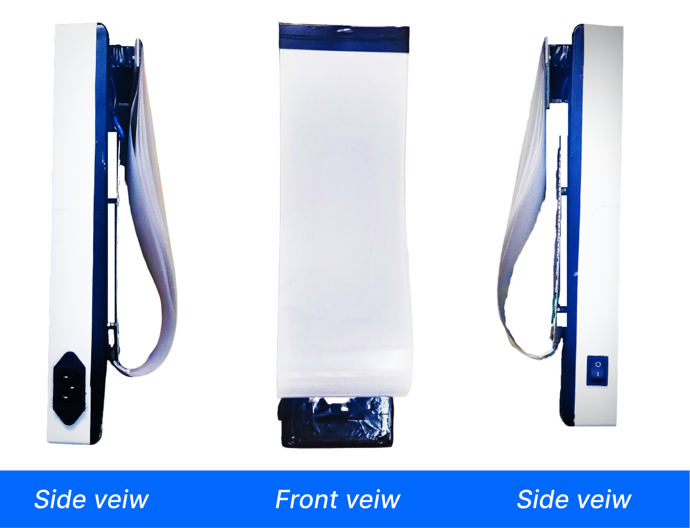
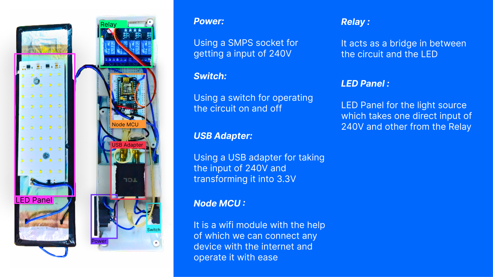
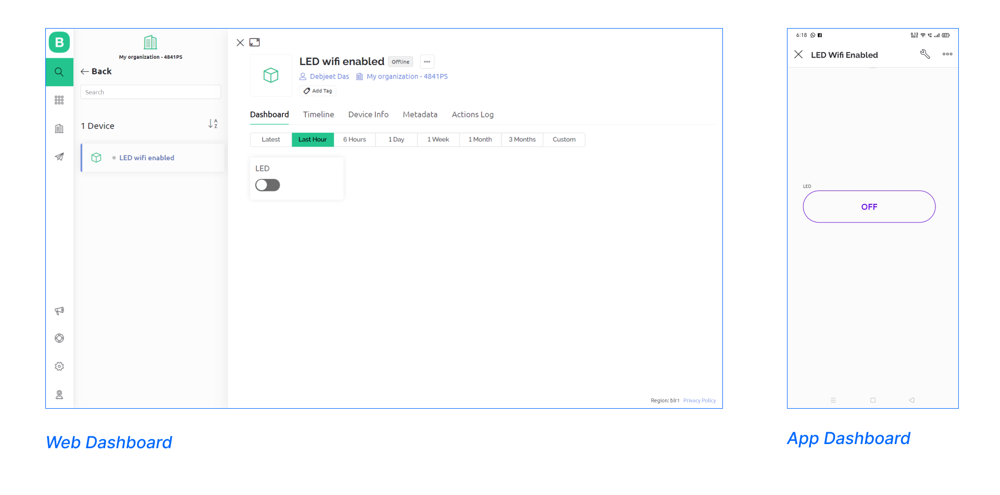
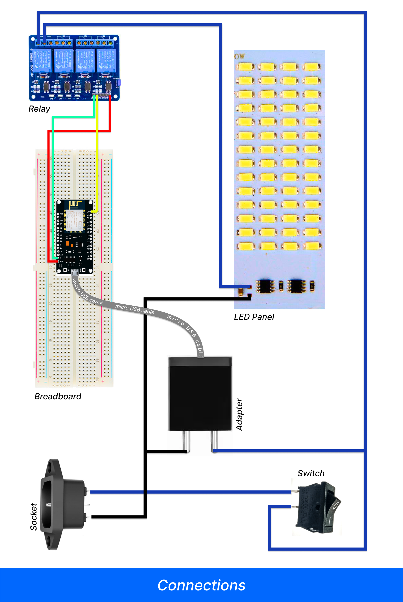
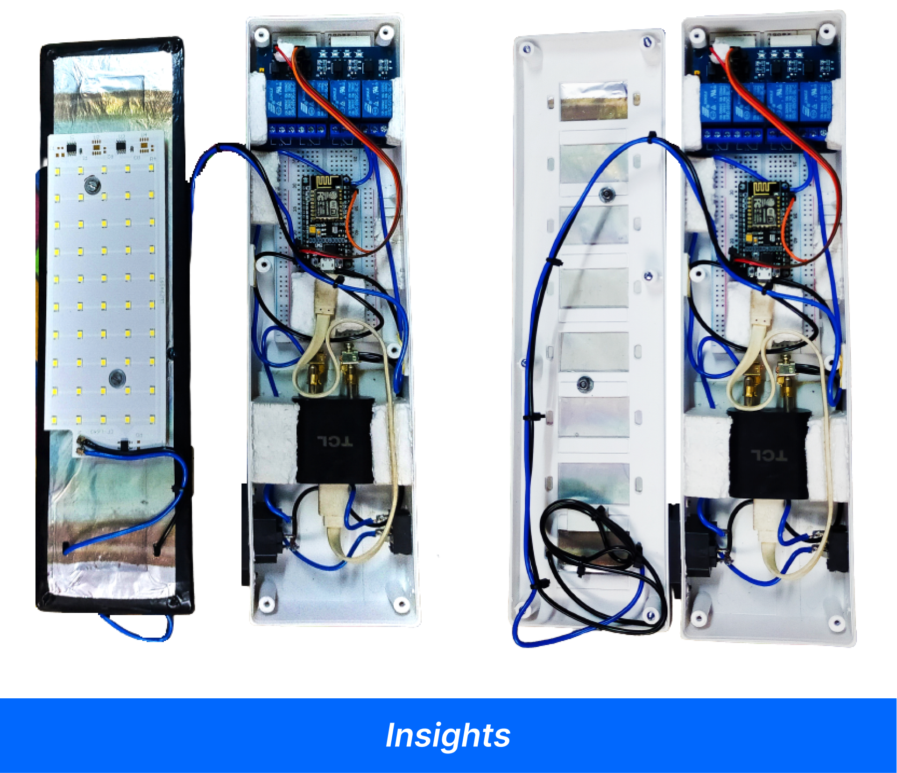

# Smart LED Lamp

 

 

## Objective
    
To build a LED lamp that is Wifi enabled, in simple words we have to make an LED lamp that can be controlled through the internet from any corner of the world.

 

## Requirements

    1. NodeMCU module
    2. Relay Module
    3. USB Adapter
    4. Micro USB cable
    5. Power Socket
    6. Switch
    7. Jumper Wires
    8. Electrical Wires
    9. Breadboard
    10. LED Light(LED panel)
    11. Switchboard(8 ways)

 

 

## How to set-up?
 

Before booting the NodeMCU we will first create a template on Blynk website for operating the module through wifi from our mobile.

Steps:

    1. Login or sign up on the Blynk website.
    2. Create a template.
    3. Choose a Hardware ESP8266 (as NodeMCU is an open-source platform based on ESP8266)
    4. Connection type Wifi
    5. Click on Done
    6. Then go to Datastream and create a new Datastream with Virtual Pin
    7. Give a name then choose PIN V0 and DATA TYPE as Integer and leave the rest of the options as it is
    8. Then click on create
    8. Go to Web Dashboard then drag and drop a toggle switch.
    9. Click on the setting icon and config the Datastream as the last one you created
    10. Save it

And then go to your mobile, install the Blynk app or proceed to the next steps if you have already downloaded it 

    1. Login with the same account.
    2. Go to the setup dashboard and select a button
    3. Then go to the button setting and change the DATASTREAM to the same one that you have given on the website
    4. And change the MODE from push to switch
    5. Save it

 

 

After doing this things open the .ino file (<a href="blnk_led_new_app/blnk_led_new_app.ino"> blnk_led_new_app.ino</a>) given in the repo.

    1. Click on the File option in the idle and copy the URL given in the Additional Boards Manager URLs from the .txt file
    2. Click ok then go to the Tool option.
    3. From the Board click on the Board Manager
    4. Then search and install esp8266

Next add the libraries

    1. Go to the sketch option and add .ZIP library from Include library
    2. Add ESP8266wifi-master.zip and blynk-library-master.zip both of them

Then again go to the Blynk website

    1. From the template name you have given, copy the BLYNK_AUTH_TOKEN
    2. Then paste it in the code (.ino file)
    3. Enter your wifi name or Hotspot name in ssid[] in the code
    4. Also enter your password of the wifi name or Hotspot name in pass[] in the code

Now, from the select Board
    
    1. Select the NodeMCU 1.0 (ESP-12E Module) and the port

After doing all the given above steps properly compile and upload the code into the NodeMCU module then you will able to operate your device from the Blynk website or application.

 

As above shown in the figure setup all the things, in the same way.

 

## How to assemble everything??
    
After booting the wifi module, stuff everything into the 8-way switchboard. I used some styrofoam for padding the modules inside the board and also attached a layer of tracing paper with acrylic sheets above the LED panel for the diffusion of light with some aluminum foil beneath the panel for heat dissipation or you can do it the way you like as shown below... 👇

 

 

And after doing all the above things properly you will have a good nice looking wifi-enabled LED Lamp... ☺️

**_Note_ 

If you are facing issues and can't file the port then do the following steps:

1.  Go to your device manager and see if the port is showing your NodeMCU 

If not

1. Unzip the given files
2. and install the CP210 (<a href="CP210x_Windows_Drivers.zip"> CP210x_Windows_Drivers.zip </a>) and CH34 (<a href="CH34x_Install_Windows_v3_4.zip"> CH34x_Install_Windows_v3_4.zip </a>) files, then install .exe files as per your architecture

This may resolve the problem... 🥴
